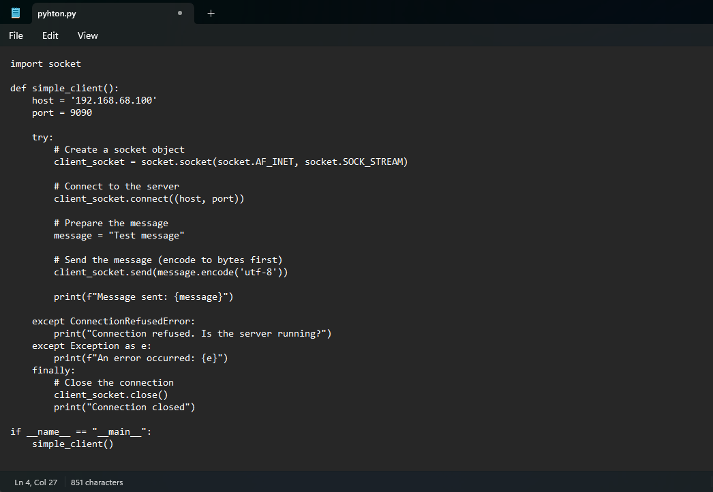

"# Network_fundamental_task2" 

# TCP Client Project




## 📌 Overview
Student 17 Write a simple Python client that connects to `localhost` port `9090` and sends the message 'Test message'. 


## Usage
```python
# client.py
import socket

def simple_client():
    """
    Simple TCP client that connects to localhost:9090 and sends a test message.
    Handles connection errors and ensures proper socket cleanup.
    """
    host = 'localhost'  # or '127.0.0.1'
    port = 9090
    
    try:
        # Create and connect socket
        with socket.socket(socket.AF_INET, socket.SOCK_STREAM) as client_socket:
            client_socket.connect((host, port))
            
            # Prepare and send message
            message = "Test message"
            client_socket.sendall(message.encode('utf-8'))
            print(f"✅ Message sent: {message}")
            
    except ConnectionRefusedError:
        print("❌ Connection refused. Is the server running?")
    except socket.timeout:
        print("⌛ Connection timeout")
    except Exception as e:
        print(f"⚠️ An error occurred: {e}")

if __name__ == "__main__":
    simple_client()


